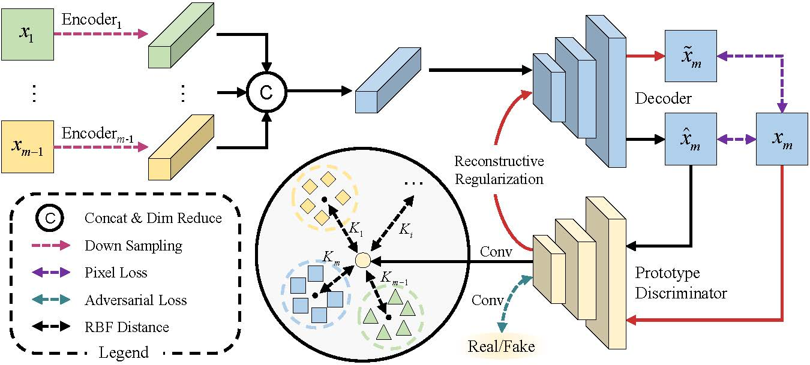
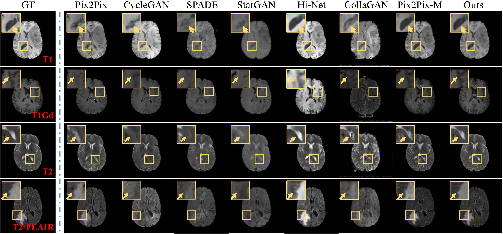
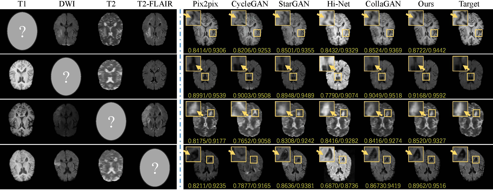
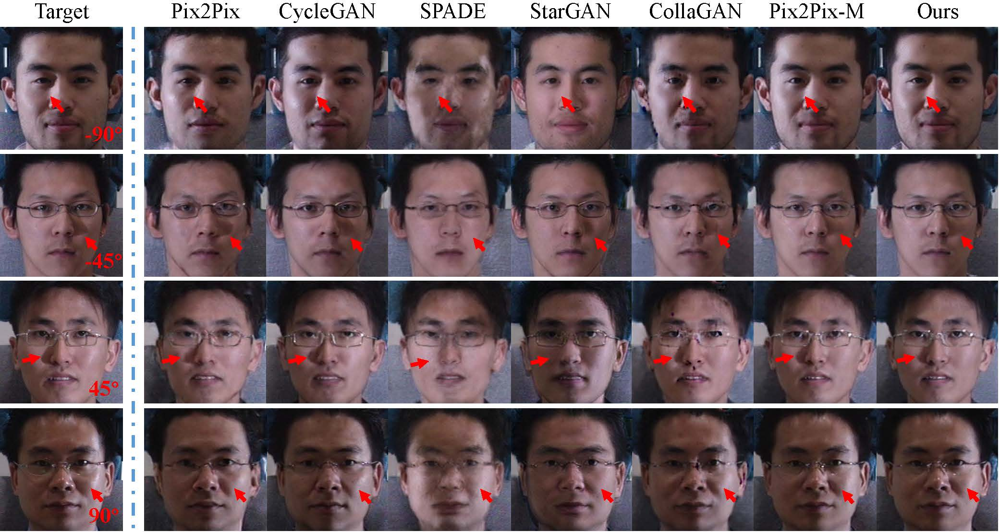

# Learning a Prototype Discriminator with RBF for Multimodal Image Synthesis

The PyTorch implements of Learning a Prototype Discriminator with RBF for Multimodal Image Synthesis.

Framework of our method.


Experiment results on BraTS2020 dataset.


Experiment results on ISLES2015 dataset.


Experiment results on CMU Multi-PIE dataset.


Experiment results on RaFD dataset.
<!--  -->

## Environment
```
python              3.8.10
pytorch             1.8.1
torchvision         0.9.1
tqdm                4.62.1
numpy               1.20.3
SimpleITK           2.1.0
scikit-learn        0.24.2
opencv-python       4.5.3.56
easydict            1.9
tensorboard         2.5.0
Pillow              8.3.1
```
## Prepare datasets
Download the datasets from the official and rearrange the files to the following structure.
### BraTS2020
```
MICCAI_BraTS2020_TrainingData
├── flair
│   ├── BraTS20_Training_001_flair.nii.gz
│   ├── BraTS20_Training_002_flair.nii.gz
│   ├── BraTS20_Training_003_flair.nii.gz
│   ├── ...
├── t2
│   ├── BraTS20_Training_001_t2.nii.gz
│   ├── BraTS20_Training_002_t2.nii.gz
│   ├── BraTS20_Training_003_t2.nii.gz
│   ├── ...
├── t1
│   ├── BraTS20_Training_001_t1.nii.gz
│   ├── BraTS20_Training_002_t1.nii.gz
│   ├── BraTS20_Training_003_t1.nii.gz
│   ├── ...
├── t1ce
│   ├── BraTS20_Training_001_t1ce.nii.gz
│   ├── BraTS20_Training_002_t1ce.nii.gz
│   ├── BraTS20_Training_003_t1ce.nii.gz
│   ├── ...
```
### ISLES2015
```
SISS2015_Training
├── 1
│   ├── VSD.Brain.XX.O.MR_T2.70616
│        ├── VSD.Brain.XX.O.MR_T2.70616.nii
│   ├── VSD.Brain.XX.O.MR_T1.70615
│        ├── VSD.Brain.XX.O.MR_T1.70615.nii
│   ├── VSD.Brain.XX.O.MR_Flair.70614
│        ├── VSD.Brain.XX.O.MR_Flair.70614.nii
│   ├── VSD.Brain.XX.O.MR_DWI.70613
│        ├── VSD.Brain.XX.O.MR_DWI.70613.nii
├── 2
│   ├── VSD.Brain.XX.O.MR_T2.70622
│        ├── VSD.Brain.XX.O.MR_T2.70622.nii
│   ├── VSD.Brain.XX.O.MR_T1.70621
│        ├── VSD.Brain.XX.O.MR_T1.70621.nii
│   ├── VSD.Brain.XX.O.MR_Flair.70620
│        ├── VSD.Brain.XX.O.MR_Flair.70620.nii
│   ├── VSD.Brain.XX.O.MR_DWI.70619
│        ├── VSD.Brain.XX.O.MR_DWI.70619.nii
├── 3
│   ├── ...
```

### CMU-MultiPIE
```
MultiPIE_Illumination
├── train
│   ├── l45
│        ├── 001.png
│        ├── 002.png
│        ├── ...
│   ├── l90
│        ├── 001.png
│        ├── 002.png
│        ├── ...
│   ├── r45
│        ├── 001.png
│        ├── 002.png
│        ├── ...
│   ├── r90
│        ├── 001.png
│        ├── 002.png
│        ├── ...
│   ├── front
│        ├── 001.png
│        ├── 002.png
│        ├── ...
├── test
│   ├── ...
```

### RaFD
For RaFD dataset, you just need to follow the original dataset with the image name like 'Rafd090_01_Caucasian_female_angry_frontal.jpg'.

## Train
```
python train.py options/brats.yaml
```

## Test
```
python test.py options/brats.yaml
```
